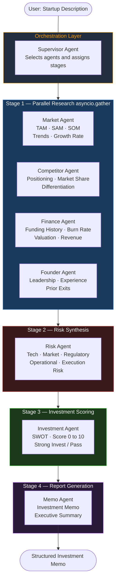
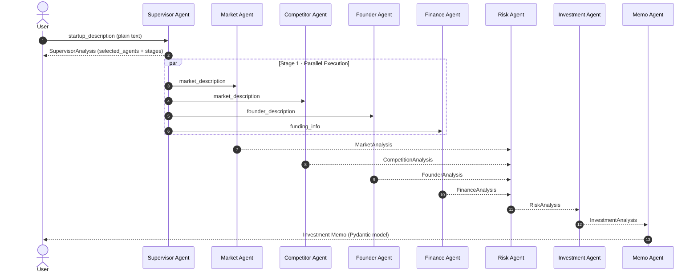
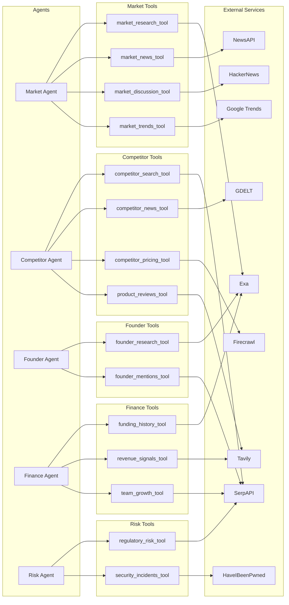

<div align="center">

```
 ██████╗ ██╗   ██╗███████╗    ██████╗ ██╗   ██╗███████╗    ██████╗ ██╗██╗     
 ██╔══██╗██║   ██║██╔════╝    ██╔══██╗██║   ██║██╔════╝    ██╔══██╗██║██║     
 ██║  ██║██║   ██║█████╗      ██║  ██║██║   ██║█████╗      ██║  ██║██║██║     
 ██║  ██║██║   ██║██╔══╝      ██║  ██║██║   ██║██╔══╝      ██║  ██║██║██║     
 ██████╔╝╚██████╔╝███████╗    ██████╔╝╚██████╔╝███████╗    ██████╔╝██║███████╗
 ╚═════╝  ╚═════╝ ╚══════╝    ╚═════╝  ╚═════╝ ╚══════╝    ╚═════╝ ╚═╝╚══════╝
```

### AI-Powered Startup Due Diligence on AWS Bedrock

[](https://www.python.org/)
[](https://aws.amazon.com/bedrock/)
[](https://github.com/strands-agents/sdk-python)
[](https://docs.pydantic.dev/)
[](LICENSE)
[](https://aws.amazon.com/developer/community/community-builders/)

</div>

---

## Overview

**Due Diligence AI** is a multi-agent, staged pipeline that automates startup investment research using [AWS Bedrock](https://aws.amazon.com/bedrock/) and the [Strands Agents SDK](https://github.com/strands-agents/sdk-python). Given a plain-text description of a startup, the system orchestrates a team of specialized AI agents — each armed with real-time web research tools — to produce a structured investment memo with a scored recommendation.

The architecture follows a **supervisor-orchestrated fan-out / fan-in** pattern across four execution stages, taking advantage of `asyncio.gather` for parallel agent execution within each stage.

---

## Architecture

### Agent Pipeline — Stage Flow



### Data Flow — Context Propagation



### Tool and Service Dependency Map



---

## Project Structure

```
aws-strand-tools/
├── app.py                          # Entry point — credential check + workflow trigger
├── async.py                        # Async utilities
│
├── workflow/
│   └── due_dilegence_workflow.py   # Supervisor fan-out orchestrator
│
├── agents/
│   ├── base_agent.py               # Abstract base — wraps Strands Agent + Bedrock model
│   ├── supervisor_agent.py         # Routes tasks to specialist agents by stage
│   ├── market_agent.py             # TAM/SAM/SOM + trends analysis
│   ├── competitor_agent.py         # Competitive landscape research
│   ├── founder_agent.py            # Leadership & team credibility
│   ├── financial_agent.py          # Funding history & financial health
│   ├── risk_agent.py               # Multi-dimensional risk scoring
│   ├── investment_agent.py         # SWOT + investment recommendation
│   └── memo_agent.py               # Final investment memo generation
│
├── tools/
│   ├── market/                     # Market research, news, trends, discussion tools
│   ├── competitor/                 # Competitor search, pricing, reviews, news tools
│   ├── founder/                    # Founder research & mentions tools
│   ├── finance/                    # Funding history, revenue signals, team growth tools
│   └── risk/                       # Regulatory risk & security incident tools
│
├── services/
│   ├── base_service.py             # Shared env-loading + HTTP helpers
│   ├── exa_service.py              # Exa neural search
│   ├── tavily_service.py           # Tavily AI search
│   ├── serpapi_service.py          # Google/Bing SERP results
│   ├── newsapi_service.py          # News API headlines
│   ├── gdelt_service.py            # GDELT global event database
│   ├── hackernews_service.py       # HackerNews discussions
│   ├── firecrawl_service.py        # Web scraping & crawling
│   ├── trends_service.py           # Google Trends pytrends
│   ├── hibp_service.py             # Have I Been Pwned — security checks
│   └── feedparser_service.py       # RSS/Atom feed parser
│
├── config/
│   ├── settings.py                 # BedrockModel config (Nova Pro, us-east-1)
│   └── agent_registry.py           # Agent registry with stage + dependency metadata
│
└── prompts/
    ├── supervisor_agent_prompt.md
    ├── market_agent_prompt.md
    ├── risk_agent_prompt.md
    └── ...
```

---

## Agents

| Agent | Stage | Domain | Output Model | Tools Used |
|---|---|---|---|---|
| **Supervisor** | 0 | Orchestration | `SupervisorAnalysis` | — |
| **Market** | 1 | Research | `MarketAnalysis` | market_research, market_news, trends, discussions |
| **Competitor** | 1 | Research | `CompetitionAnalysis` | competitor_search, pricing, reviews, news |
| **Founder** | 1 | Research | `FounderAnalysis` | founder_research, mentions |
| **Finance** | 1 | Research | `FinanceAnalysis` | funding_history, revenue_signals, team_growth |
| **Risk** | 2 | Analysis | `RiskAnalysis` | regulatory_risk, security_incidents |
| **Investment** | 3 | Analysis | `InvestmentAnalysis` | — |
| **Memo** | 4 | Reporting | `MemoAnalysis` | — |

All agents extend `BaseAgent`, which wraps the Strands `Agent` with a `BedrockModel` and enforces structured output via a Pydantic `response_model`.

---

## Tech Stack

| Layer | Technology |
|---|---|
| **LLM Runtime** | [AWS Bedrock](https://aws.amazon.com/bedrock/) — `us.amazon.nova-pro-v1:0` |
| **Agent Framework** | [Strands Agents SDK](https://github.com/strands-agents/sdk-python) |
| **Prompt Caching** | Bedrock `CacheConfig(strategy="auto")` |
| **Structured Output** | Pydantic v2 models as `structured_output_model` |
| **Concurrency** | `asyncio.gather` — parallel stage execution |
| **Web Research** | Exa · Tavily · SerpAPI · NewsAPI · GDELT · HackerNews · Firecrawl |
| **Signals** | Google Trends · Have I Been Pwned · FeedParser (RSS) |
| **Python** | 3.12 with `uv` virtual environment |

---

## Prerequisites

- Python 3.12+
- AWS account with **Bedrock access** in `us-east-1`
- Model access enabled for `us.amazon.nova-pro-v1:0` in the Bedrock console
- AWS credentials configured via `~/.aws/credentials`, environment variables, or an IAM role

---

## Setup

```bash
# Clone the repository
git clone https://github.com/your-username/aws-strand-tools.git
cd aws-strand-tools

# Create and activate virtual environment
python -m venv .venv
source .venv/bin/activate   # Windows: .venv\Scripts\activate

# Install dependencies
pip install -r requirements.txt
```

### Environment Variables

Create a `.env` file in the project root:

```env
# AWS credentials (or use IAM role / aws configure)
AWS_ACCESS_KEY_ID=your_access_key
AWS_SECRET_ACCESS_KEY=your_secret_key
AWS_DEFAULT_REGION=us-east-1

# Web research services (configure the ones you need)
EXA_API_KEY=your_exa_key
TAVILY_API_KEY=your_tavily_key
SERPAPI_API_KEY=your_serpapi_key
NEWSAPI_API_KEY=your_newsapi_key
FIRECRAWL_API_KEY=your_firecrawl_key
HIBP_API_KEY=your_hibp_key
```

---

## Usage

```bash
python app.py
```

The default run in `app.py` analyzes **Cursor AI**:

```python
asyncio.run(due_diligence_workflow(
    startup_description="Analyze Cursor AI a startup that provides a code search tool..."
))
```

To analyze a different startup, update the `startup_description` argument:

```python
asyncio.run(due_diligence_workflow(
    startup_description="Analyze [Startup Name] — [brief description] — investment analysis required."
))
```

### Expected Output

The pipeline produces a structured investment memo containing:

- **Market Analysis** — TAM/SAM/SOM, growth rate, key trends, market score (0–10)
- **Competitive Landscape** — Top competitors, positioning, moat assessment
- **Founder Profile** — Team credibility, experience, prior exits
- **Financial Health** — Funding rounds, burn rate, revenue signals
- **Risk Assessment** — Tech, market, regulatory, operational risks (scored 0–10)
- **Investment Recommendation** — SWOT, investment score, `Strong Invest / Invest / Monitor / Pass`
- **Investment Memo** — Executive summary for LP/GP review

---

## AWS Bedrock Configuration

The model is configured in [config/settings.py](config/settings.py):

```python
@dataclass
class Settings:
    model_name: str = "us.amazon.nova-pro-v1:0"
    region_name: str = "us-east-1"
    max_tokens: int = 4096
    temperature: float = 0.7

    def get_model(self):
        return BedrockModel(
            model_id=self.model_name,
            region_name=self.region_name,
            max_tokens=self.max_tokens,
            temperature=self.temperature,
            cache_config=CacheConfig(strategy="auto"),
        )
```

`CacheConfig(strategy="auto")` enables **Bedrock prompt caching**, which reduces cost and latency on repeated system-prompt calls — particularly valuable since all 7 agents share the same Bedrock endpoint.

---

## Key Design Decisions

**Why Strands Agents SDK?**
Strands is purpose-built for AWS Bedrock and provides native `structured_output_model` support with Pydantic — eliminating brittle JSON parsing from raw LLM output.

**Why a Supervisor Agent instead of a static graph?**
The Supervisor Agent dynamically selects which specialist agents to run and assigns their execution stage based on the startup description. This allows the pipeline to skip irrelevant agents and reduces unnecessary Bedrock API calls.

**Why staged fan-out with `asyncio.gather`?**
Research agents in Stage 1 have no data dependencies between them — running them in parallel cuts wall-clock time roughly 4×. Stages 2–4 are sequential because each depends on the prior stage's structured output.

**Why Pydantic `response_model` on every agent?**
Each agent's output is immediately consumed as typed input by the next stage. Enforcing schema at the LLM boundary prevents silent data loss or hallucinated field names from propagating downstream.

---

## Contributing

1. Fork the repository
2. Create a feature branch (`git checkout -b feature/new-agent`)
3. Commit your changes
4. Open a Pull Request

---

## License

MIT License — see [LICENSE](LICENSE) for details.

---

<div align="center">

Built with the [AWS Strands Agents SDK](https://github.com/strands-agents/sdk-python) · Powered by [Amazon Bedrock](https://aws.amazon.com/bedrock/)

</div>
