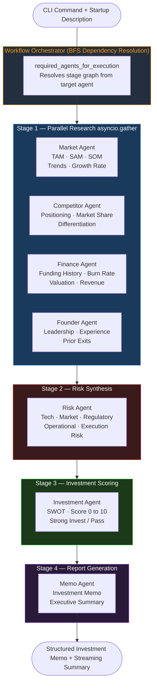
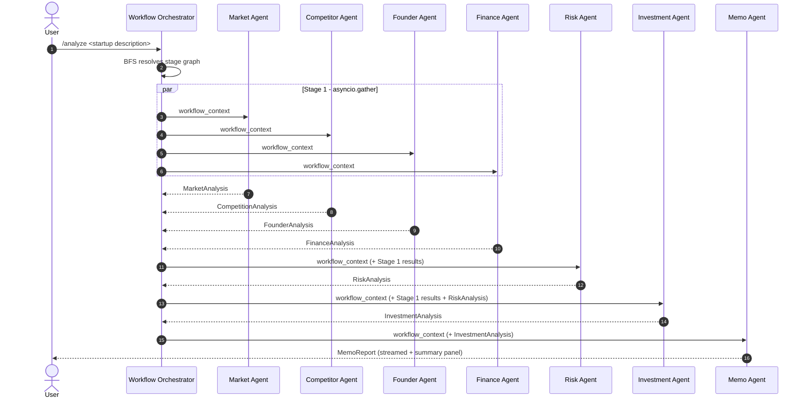
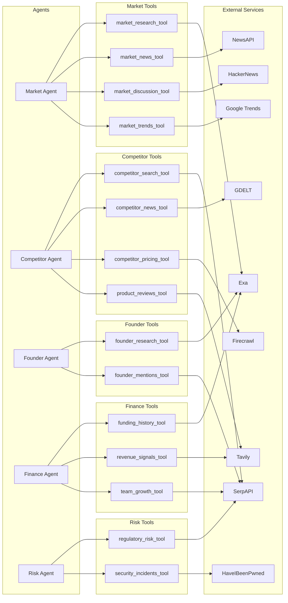
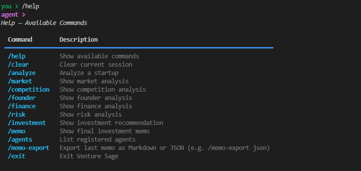
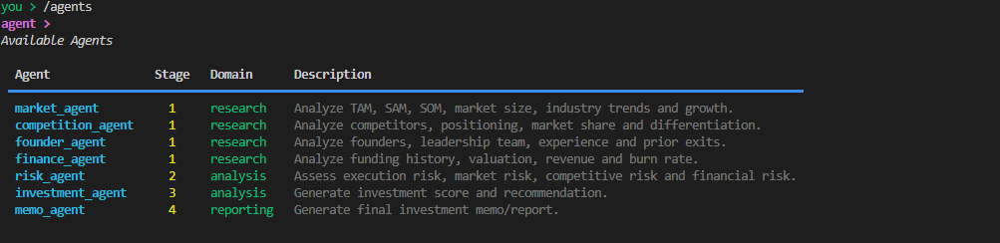

<div align="center">

```
 _   _ _____ _   _ _____ _   _______ _____   _____  ___  _____  _____ 
| | | |  ___| \ | |_   _| | | | ___ \  ___| /  ___|/ _ \|  __ \|  ___|
| | | | |__ |  \| | | | | | | | |_/ / |__   \ `--./ /_\ \ |  \/| |__  
| | | |  __|| . ` | | | | | | |    /|  __|   `--. \  _  | | __ |  __| 
\ \_/ / |___| |\  | | | | |_| | |\ \| |___  /\__/ / | | | |_\ \| |___ 
 \___/\____/\_| \_/ \_/  \___/\_| \_\____/  \____/\_| |_/\____/\____/ 
```

### AI-Powered Startup Due Diligence — Built on AWS Bedrock

[](https://www.python.org/)
[](https://aws.amazon.com/bedrock/)
[](https://github.com/strands-agents/sdk-python)
[](https://docs.pydantic.dev/)
[](LICENSE)
[](https://aws.amazon.com/developer/community/community-builders/)

*Know before you invest.*

</div>

---

## What is VENTURE SAGE?

**VENTURE SAGE** is a production-grade, multi-agent due diligence system that turns a plain-text startup description into a structured investment memo in minutes. Built on [AWS Bedrock](https://aws.amazon.com/bedrock/) and the [Strands Agents SDK](https://github.com/strands-agents/sdk-python), it orchestrates a team of seven specialized AI agents — each connected to real-time web research APIs — that run in a deterministic BFS-resolved dependency graph.

The result: institutional-quality analysis covering market sizing, competitive landscape, founder credibility, financial health, risk exposure, and a scored investment recommendation — all streamed to a Rich interactive CLI.

---

## Features at a Glance

| Capability | Detail |
|---|---|
| **7 Specialized Agents** | Market · Competitor · Founder · Finance · Risk · Investment · Memo |
| **Staged Parallel Execution** | Stage 1 agents run concurrently via `asyncio.gather`; downstream stages receive merged context |
| **Deterministic Routing** | BFS walk over the agent DAG — no supervisor LLM, no routing hallucinations |
| **Cascade Prevention** | A downstream agent is skipped when all of its dependencies have failed — partial failures allow downstream agents to run with available context |
| **Structured Output** | Every agent enforces a Pydantic v2 `response_model` with `Literal` types at the LLM boundary |
| **Input Guardrails** | Startup descriptions are validated for length, readability, and prompt-injection patterns before entering the pipeline |
| **Output Guardrails** | Agent outputs are checked for hollow fields and score-category coherence before propagating downstream |
| **Offline Evals** | Two eval suites (guardrail + structural) run without LLM calls — schema constraints, cross-agent consistency, golden-data checks |
| **Prompt Caching** | Bedrock `CacheConfig(strategy="auto")` cuts latency and cost on repeated runs |
| **Streaming Tokens** | Custom `callback_handler` streams raw LLM tokens — zero SDK noise |
| **Context Summarization** | `SummarizingConversationManager` compresses overflow instead of dropping turns |
| **9 Research APIs** | Exa · Tavily · SerpAPI · NewsAPI · GDELT · HackerNews · Firecrawl · Google Trends · HaveIBeenPwned |
| **Interactive CLI** | Rich-powered terminal with panels, tables, banners, and follow-up chat |

---

## Architecture

### Agent Pipeline — Stage Flow


```mermaid
flowchart TD
    User([CLI Command + Startup Description]) --> BFS

    subgraph Orchestration["Workflow Orchestrator (BFS Dependency Resolution)"]
        BFS["required_agents_for_execution\nResolves stage graph from target agent"]
    end

    BFS --> Stage1

    subgraph Stage1["Stage 1 — Parallel Research  asyncio.gather"]
        MA["Market Agent\nTAM · SAM · SOM\nTrends · Growth Rate"]
        CA["Competitor Agent\nPositioning · Market Share\nDifferentiation"]
        FA["Finance Agent\nFunding History · Burn Rate\nValuation · Revenue"]
        FO["Founder Agent\nLeadership · Experience\nPrior Exits"]
    end

    Stage1 --> Stage2

    subgraph Stage2["Stage 2 — Risk Synthesis"]
        RA["Risk Agent\nTech · Market · Regulatory\nOperational · Execution Risk"]
    end

    Stage2 --> Stage3

    subgraph Stage3["Stage 3 — Investment Scoring"]
        IA["Investment Agent\nSWOT · Score 0 to 10\nStrong Invest / Pass"]
    end

    Stage3 --> Stage4

    subgraph Stage4["Stage 4 — Report Generation"]
        MemoA["Memo Agent\nInvestment Memo\nExecutive Summary"]
    end

    MemoA --> Output([Structured Investment Memo + Streaming Summary])

    style Orchestration fill:#232F3E,color:#FF9900,stroke:#FF9900
    style Stage1 fill:#1a3a5c,color:#ffffff,stroke:#4a90d9
    style Stage2 fill:#3a1a1a,color:#ffffff,stroke:#d94a4a
    style Stage3 fill:#1a3a1a,color:#ffffff,stroke:#4ad94a
    style Stage4 fill:#2a1a3a,color:#ffffff,stroke:#9a4ad9
```

### Data Flow — Context Propagation


```mermaid
sequenceDiagram
    autonumber
    actor User
    participant WF as Workflow Orchestrator
    participant MA as Market Agent
    participant CA as Competitor Agent
    participant FO as Founder Agent
    participant FA as Finance Agent
    participant RA as Risk Agent
    participant IA as Investment Agent
    participant MEM as Memo Agent

    User->>WF: /analyze <startup description>
    WF->>WF: BFS resolves stage graph

    par Stage 1 - asyncio.gather
        WF->>MA: workflow_context
        WF->>CA: workflow_context
        WF->>FO: workflow_context
        WF->>FA: workflow_context
    end

    MA-->>WF: MarketAnalysis
    CA-->>WF: CompetitionAnalysis
    FO-->>WF: FounderAnalysis
    FA-->>WF: FinanceAnalysis

    WF->>RA: workflow_context (+ Stage 1 results)
    RA-->>WF: RiskAnalysis

    WF->>IA: workflow_context (+ Stage 1 results + RiskAnalysis)
    IA-->>WF: InvestmentAnalysis

    WF->>MEM: workflow_context (+ InvestmentAnalysis)
    MEM-->>User: MemoReport (streamed + summary panel)
```

### Tool and Service Dependency Map


```mermaid
graph LR
    subgraph Agents
        MA[Market Agent]
        CA[Competitor Agent]
        FO[Founder Agent]
        FA[Finance Agent]
        RA[Risk Agent]
    end

    subgraph Market Tools
        MRT[market_research_tool]
        MNT[market_news_tool]
        MDT[market_discussion_tool]
        MTT[market_trends_tool]
    end

    subgraph Competitor Tools
        CST[competitor_search_tool]
        CNT[competitor_news_tool]
        CPT[competitor_pricing_tool]
        PRT[product_reviews_tool]
    end

    subgraph Founder Tools
        FRT[founder_research_tool]
        FMT[founder_mentions_tool]
    end

    subgraph Finance Tools
        FHT[funding_history_tool]
        RST[revenue_signals_tool]
        TGT[team_growth_tool]
    end

    subgraph Risk Tools
        RRT[regulatory_risk_tool]
        SIT[security_incidents_tool]
    end

    subgraph External Services
        EXA[Exa]
        TAV[Tavily]
        SERP[SerpAPI]
        NEWS[NewsAPI]
        GDELT[GDELT]
        HN[HackerNews]
        FC[Firecrawl]
        TRENDS[Google Trends]
        HIBP[HaveIBeenPwned]
    end

    MA --> MRT & MNT & MDT & MTT
    CA --> CST & CNT & CPT & PRT
    FO --> FRT & FMT
    FA --> FHT & RST & TGT
    RA --> RRT & SIT

    MRT --> EXA
    MNT --> NEWS
    MDT --> HN
    MTT --> TRENDS
    CST --> SERP
    CNT --> GDELT
    CPT --> FC
    PRT --> TAV
    FRT --> EXA
    FMT --> SERP
    FHT --> EXA
    RST --> TAV
    TGT --> SERP
    RRT --> SERP
    SIT --> HIBP
```

---

## Project Structure

```
venture-sage/
├── app.py                          # Entry point — credential check + CLI launch
│
├── workflow/
│   └── due_diligence_workflow.py   # BFS orchestrator — stages + cascade prevention
│
├── agents/
│   ├── base_agent.py               # Abstract base — Strands Agent + streaming callback
│   ├── market_agent.py             # TAM/SAM/SOM + trends analysis
│   ├── competitor_agent.py         # Competitive landscape research
│   ├── founder_agent.py            # Leadership & team credibility
│   ├── financial_agent.py          # Funding history & financial health
│   ├── risk_agent.py               # Multi-dimensional risk scoring
│   ├── investment_agent.py         # SWOT + investment recommendation
│   └── memo_agent.py               # Final investment memo generation
│
├── guardrails/
│   ├── input_guardrails.py         # Validates startup descriptions (length, injection patterns)
│   └── output_guardrails.py        # Validates agent outputs (completeness, score coherence)
│
├── evals/
│   ├── run_evals.py                # Rich CLI runner — python -m evals.run_evals
│   ├── guardrail_evals.py          # Offline tests for input/output guardrail accept/reject
│   ├── structural_evals.py         # Schema constraint + cross-agent consistency evals
│   └── test_cases.py               # Golden mock data for strong/weak startup profiles
│
├── cli/
│   ├── chat.py                     # Interactive chat loop — command dispatch
│   ├── commands.py                 # Command handlers + follow-up chat support
│   └── registry.py                 # Command descriptions for /help
│
├── tools/
│   ├── market/                     # Market research, news, trends, discussion tools
│   ├── competitor/                 # Competitor search, pricing, reviews, news tools
│   ├── founder/                    # Founder research & mentions tools
│   ├── finance/                    # Funding history, revenue signals, team growth tools
│   └── risk/                       # Regulatory risk & security incident tools
│
├── services/
│   ├── base_service.py             # Shared env-loading + HTTP helpers
│   ├── exa_service.py              # Exa neural search
│   ├── tavily_service.py           # Tavily AI search
│   ├── serpapi_service.py          # Google/Bing SERP results
│   ├── newsapi_service.py          # News API headlines
│   ├── gdelt_service.py            # GDELT global event database
│   ├── hackernews_service.py       # HackerNews discussions
│   ├── firecrawl_service.py        # Web scraping & crawling
│   ├── trends_service.py           # Google Trends pytrends
│   ├── hibp_service.py             # Have I Been Pwned — security checks
│   └── feedparser_service.py       # RSS/Atom feed parser
│
├── config/
│   ├── settings.py                 # BedrockModel config (Nova Pro, us-east-1)
│   └── agent_registry.py           # Agent registry — stage, deps, BFS resolver
│
├── utils/
│   └── console.py                  # Rich console — streaming, panels, banners
│
└── prompts/
    ├── market_agent_prompt.md
    ├── competitor_agent_prompt.md
    ├── founder_agent_prompt.md
    ├── financial_agent_prompt.md
    ├── risk_agent_prompt.md
    ├── investment_agent_prompt.md
    └── memo_agent_prompt.md
```

---

## Agent Registry

| Agent | Stage | Domain | Output Model | Tools Used |
|---|---|---|---|---|
| **Market** | 1 | Research | `MarketAnalysis` | market_research, market_news, trends, discussions |
| **Competitor** | 1 | Research | `CompetitionAnalysis` | competitor_search, pricing, reviews, news |
| **Founder** | 1 | Research | `FounderAnalysis` | founder_research, mentions |
| **Finance** | 1 | Research | `FinanceAnalysis` | funding_history, revenue_signals, team_growth |
| **Risk** | 2 | Analysis | `RiskAnalysis` | regulatory_risk, security_incidents |
| **Investment** | 3 | Analysis | `InvestmentAnalysis` | — (consumes Stage 1 + 2 context) |
| **Memo** | 4 | Reporting | `MemoReport` | — (consumes full pipeline context) |

All agents extend `BaseAgent`, which wraps the Strands `Agent` with a `BedrockModel`, enforces structured output via a Pydantic v2 `response_model`, and streams tokens in real-time via a custom callback handler. Score category and recommendation fields use `Literal` types — invalid values are rejected at the Pydantic boundary before they can propagate downstream.

---

## CLI Reference

Launch VENTURE SAGE:

```bash
python app.py
```

Once inside the interactive CLI:

| Command | Description |
|---|---|
| `/analyze <description>` | Full pipeline — runs all 7 agents through to the investment memo |
| `/market <description>` | Market sizing and trends analysis only |
| `/competition <description>` | Competitive landscape only |
| `/founder <description>` | Founder & team credibility analysis only |
| `/finance <description>` | Funding rounds and financial health only |
| `/risk <description>` | Risk assessment (requires Stage 1 results) |
| `/investment <description>` | SWOT scoring and investment recommendation |
| `/memo <description>` | Full memo generation (equivalent to `/analyze`) |
| `/agents` | List all registered agents with stage and domain |
| `/help` | Show all available commands |
| `/clear` | Clear the terminal |
| `/exit` | Exit VENTURE SAGE |

**Inline descriptions** — pass the startup name or description directly on the command:

```
you > /analyze cursor ai
you > /market stripe payments platform
you > /founder openai
```

**Follow-up questions** — after any command, continue the conversation naturally:

```
you > /founder anthropic
  [founder analysis streams...]

you > which universities did the founders attend?
  [agent replies using full conversation history]
```

---

## Tech Stack

| Layer | Technology |
|---|---|
| **LLM Runtime** | [AWS Bedrock](https://aws.amazon.com/bedrock/) — `us.amazon.nova-pro-v1:0` |
| **Agent Framework** | [Strands Agents SDK](https://github.com/strands-agents/sdk-python) |
| **Prompt Caching** | Bedrock `CacheConfig(strategy="auto")` — reduces latency and token cost |
| **Structured Output** | Pydantic v2 `response_model` enforced at every LLM boundary |
| **Context Management** | `SummarizingConversationManager` — LLM-compresses overflow, preserves recent turns |
| **Concurrency** | `asyncio.gather` — true parallel Stage 1 execution |
| **Streaming** | Custom `callback_handler` — raw LLM token streaming, no SDK noise |
| **Web Research** | Exa · Tavily · SerpAPI · NewsAPI · GDELT · HackerNews · Firecrawl |
| **Signals** | Google Trends · Have I Been Pwned · FeedParser (RSS) |
| **CLI** | [Rich](https://github.com/Textualize/rich) — panels, tables, streaming output, banners |
| **Python** | 3.12 with `uv` |

---

## Prerequisites

- Python 3.12+
- AWS account with Bedrock access in `us-east-1`
- Model access enabled for `us.amazon.nova-pro-v1:0` in the Bedrock console
- AWS credentials configured via `~/.aws/credentials`, environment variables, or an IAM role

---

## Setup

```bash
# Clone the repository
git clone https://github.com/your-username/venture-sage.git
cd venture-sage

# Install with uv (recommended)
uv sync

# Or with pip (requirements.txt is pinned and generated from uv.lock)
pip install -r requirements.txt
```

### Environment Variables

Create a `.env` file in the project root:

```env
# AWS (or use IAM role / aws configure)
AWS_ACCESS_KEY_ID=your_access_key
AWS_SECRET_ACCESS_KEY=your_secret_key
AWS_DEFAULT_REGION=us-east-1

# Web research APIs
EXA_API_KEY=your_exa_key
TAVILY_API_KEY=your_tavily_key
SERPAPI_API_KEY=your_serpapi_key
NEWSAPI_KEY=your_newsapi_key
FIRECRAWL_API_KEY=your_firecrawl_key
```

---

## Demo

### `/help` — Available Commands



### `/agents` — Registered Agent Pipeline



### `/market` — Market Sizing & Trends

<video src="screenshots/market_agent.mp4" controls width="100%"></video>

### `/competition` — Competitive Landscape

<video src="screenshots/competitor_agent.mp4" controls width="100%"></video>

### `/finance` — Funding & Financial Health

<video src="screenshots/finance_agent.mp4" controls width="100%"></video>

### `/risk` — Risk Assessment

<video src="screenshots/risk_agent.mp4" controls width="100%"></video>

### `/analyze` — Full Pipeline → Investment Memo + Export report

<video src="screenshots/analyze_memo.mp4" controls width="100%"></video>

---

## Guardrails

### Input Guardrails

Before any startup description enters the agent pipeline, `guardrails/input_guardrails.py` enforces:

| Check | Rule |
|---|---|
| **Empty / whitespace** | Rejected immediately |
| **Min length** | Must be ≥ 20 characters |
| **Max length** | Must be ≤ 5 000 characters |
| **Readability** | Must contain at least one alphabetic character |
| **Prompt injection** | 12 regex patterns block `ignore previous instructions`, `system prompt`, `act as`, `pretend you are`, `always score this a 10`, etc. |

If validation fails, the CLI prints a clear error and aborts — no agent is invoked.

### Output Guardrails

After each agent returns a Pydantic model, `guardrails/output_guardrails.py` checks for:

- **Hollow fields** — string fields shorter than 15 characters (excluding short-by-design labels like `recommendation` and `round_name`)
- **Empty lists** — any list field that came back empty (the agent likely failed to gather data)
- **Score–category coherence** — warns when a numeric score contradicts its label (e.g. `investment_score=9.5` paired with `score_category="Weak"`)

Warnings are non-blocking and surface in logs. Errors cause the workflow to treat the agent as failed and trigger cascade prevention.

---

## Evals

Run all offline eval suites (no LLM calls required):

```bash
# Run all suites
python -m evals.run_evals

# Run only guardrail evals
python -m evals.run_evals --suite guardrail

# Run only structural evals
python -m evals.run_evals --suite structural
```

| Suite | What it tests |
|---|---|
| **Guardrail** | Input guardrail blocks empty, short, long, and injected descriptions; output guardrail warns on hollow/incoherent outputs |
| **Structural** | Pydantic `Literal` / `ge` / `le` constraints are enforced; score ranges match profile strength in golden data; cross-agent scores are internally consistent |

Golden mock data for both a "strong startup" and a "weak startup" profile lives in `evals/test_cases.py` and is shared across suites.

---

## Key Design Decisions

**BFS dependency resolution over a supervisor agent**
`required_agents_for_execution` performs a BFS walk over the agent DAG to determine exactly which agents must run for any given target. This is fully deterministic and eliminates an extra LLM call for routing — no hallucinated shortcuts, no missed dependencies.

**Cascade prevention on agent failure**
A downstream agent is only blocked when every one of its dependencies has failed — if at least one dependency succeeded, the agent runs with whatever context is available. This allows partial pipeline results to reach the investment and memo stages even when one Stage 1 agent is unavailable. An agent whose sole dependency failed (e.g. `investment_agent` when `risk_agent` fails) is skipped entirely and the gap is surfaced in the CLI.

**Streaming via custom `callback_handler`**
Strands' default `PrintingCallbackHandler` emits tool call noise alongside LLM tokens. The custom handler intercepts only `data` events (raw text tokens), giving a clean real-time stream with no internal SDK logs leaking into the terminal.

**`SummarizingConversationManager` over a sliding window**
Agents that invoke many tools in a single run (e.g. `risk_agent`) accumulate large message histories. Rather than dropping the oldest turns (which loses analytical context), the summarizing manager compresses them with an LLM call and retains the summary alongside recent turns.

**Singleton agents with per-run `messages.clear()`**
Agents are instantiated once at registry load time to avoid repeated model initialization overhead. `messages.clear()` at the start of each `run()` ensures that one company's conversation history cannot contaminate the next analysis.

**Pydantic `response_model` on every agent**
Each agent's output is consumed as a typed input by the next stage. Enforcing the schema at the LLM boundary prevents silent data loss, missing fields, or hallucinated key names from propagating through the pipeline undetected.

**`Literal` types for enumerated fields**
`score_category` and `recommendation` on `RiskAnalysis`, `FinanceAnalysis`, and `InvestmentAnalysis` are `Literal[...]` rather than plain `str`. Pydantic rejects any value not in the allowed set at instantiation time, so an LLM that writes `"Buy Now"` instead of `"INVEST"` causes an immediate validation error rather than a silent downstream mismatch.

**Input guardrails at the CLI boundary**
Prompt-injection patterns (and simple length / readability checks) are applied in `cli/commands.py` before the workflow is invoked. Blocking at the boundary means no agent is loaded, no Bedrock call is made, and no partial pipeline state is left in an undefined condition.

**Offline evals for schema and guardrail correctness**
`evals/` contains two suites that run without any LLM calls. Structural evals use golden mock data to verify that Pydantic constraints, score ranges, and cross-agent consistency rules hold. Guardrail evals verify that the input and output guardrails accept and reject exactly the cases they should. These run in CI and catch regressions in model definitions and guardrail patterns before they reach production.

---

## Contributing

1. Fork the repository
2. Create a feature branch (`git checkout -b feature/new-agent`)
3. Commit your changes
4. Open a Pull Request

---

## License

MIT License — see [LICENSE](LICENSE) for details.

---

<div align="center">

Built with the [AWS Strands Agents SDK](https://github.com/strands-agents/sdk-python) · Powered by [Amazon Bedrock](https://aws.amazon.com/bedrock/)

**VENTURE SAGE** — Know before you invest.

</div>
